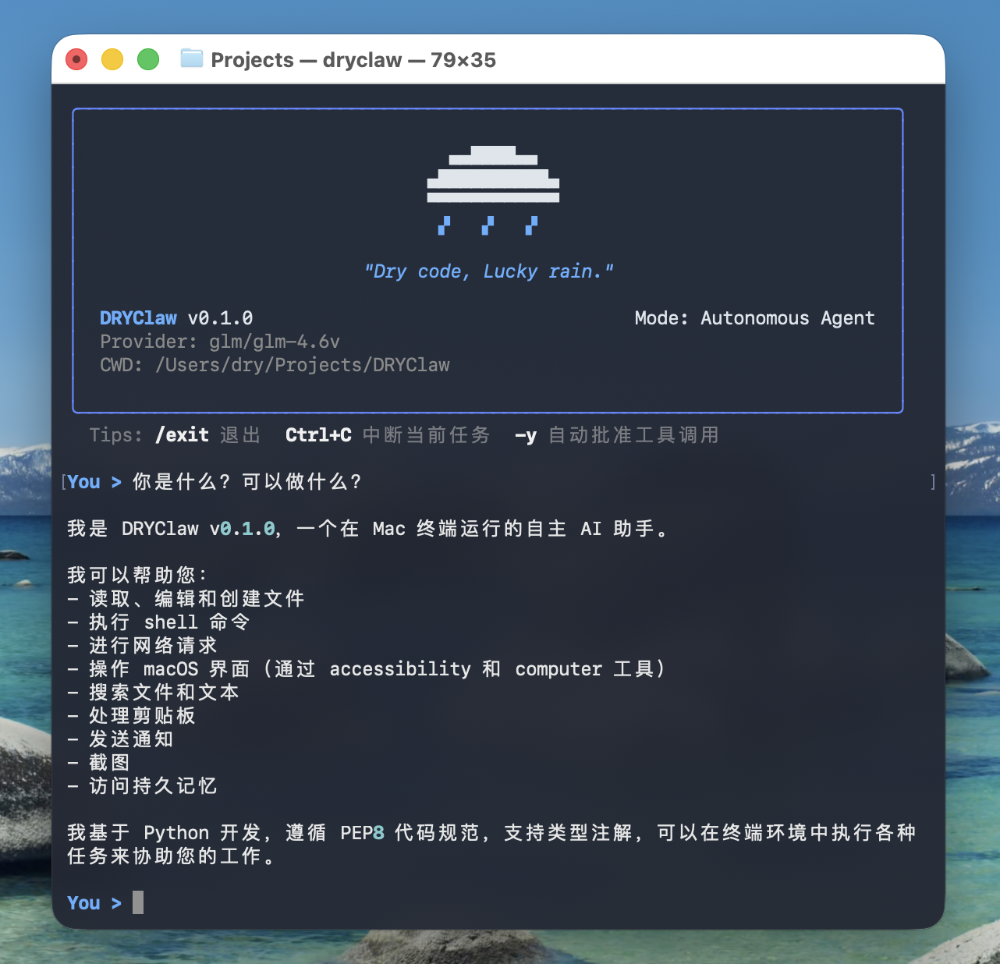

# DRYClaw

Language: English | [中文](README.zh-CN.md)

DRYClaw is a Python AI agent CLI for terminal-first workflows, including file operations, shell execution, web interactions, scheduling, and daemon mode.



## Project Overview

- Lightweight CLI agent loop with tool calling
- Local session persistence and memory append support
- macOS-friendly automation helpers (including accessibility-based flow)
- Schedule and daemon commands for continuous workflows

## 📺 演示视频 | Demo Videos

<table style="width: 100%; table-layout: fixed; border-collapse: collapse; border: none;">
  <tr>
    <td style="padding: 10px; border: none;">
      <strong>1. 基础操控与权限引擎</strong><br>
      <i>Basic Control & Permission Engine</i>
      <p style="font-size: 0.9em; color: #666;">
        演示终端基础命令执行与三层安全权限过滤流程。<br>
        Showcases basic command execution and the 3-layer security filtering.
      </p>
      <video src="=https://github.com/user-attachments/assets/ddfc4e3f-2820-4c6a-9b1e-779b035247f1

" controls="controls" style="max-width: 100%; border-radius: 8px; box-shadow: 0 4px 8px rgba(0,0,0,0.1);"></video>
    </td>
    <td style="padding: 10px; border: none;">
      <strong>2. 多模型适配展示</strong><br>
      <i>Multi-Provider Adaptation</i>
      <p style="font-size: 0.9em; color: #666;">
        展示在 Anthropic/GLM/OpenAI 之间无缝切换的能力。<br>
        Demonstrates seamless switching between different LLM providers.
      </p>
      <video src="https://github.com/user-attachments/assets/2d4461c0-4775-4e2b-829c-d9dd0b52a557" controls="controls" style="max-width: 100%; border-radius: 8px; box-shadow: 0 4px 8px rgba(0,0,0,0.1);"></video>
    </td>
  </tr>
</table>

<br>

<div style="width: 100%; padding: 10px;">
  <strong>3. GUI 视觉交互全流程 (核心演示)</strong><br>
  <i>Full GUI & Vision Interaction Workflow (Core Demo)</i>
  <p style="font-size: 0.9em; color: #666;">
    完整演示 Agent 如何通过 IPC 桥接 macOS 无障碍服务，实现复杂的跨应用图形界面操控。<br>
    A complete walkthrough of the Agent controlling macOS GUI applications via IPC bridging with Accessibility Services.
  </p>
  <video src="[这里替换为你拖拽全屏视频生成的链接](https://github.com/user-attachments/assets/c4544462-f9ac-4c2e-8663-eca6c54d0c7b)" controls="controls" style="width: 100%; border-radius: 8px; box-shadow: 0 4px 8px rgba(0,0,0,0.1);"></video>
</div>

## 📺 演示视频 | Demo Videos

<table style="width: 100%; table-layout: fixed; border-collapse: collapse; border: none;">
  <tr>
    <td style="padding: 10px; border: none;">
      <strong>1. 基础操控与权限引擎</strong><br>
      <i>Basic Control & Permission Engine</i>
      <p style="font-size: 0.9em; color: #666;">
        演示终端基础命令执行与三层安全权限过滤流程。<br>
        Showcases basic command execution and the 3-layer security filtering.
      </p>
      <video src="https://github.com/user-attachments/assets/ddfc4e3f-2820-4c6a-9b1e-779b035247f1" controls="controls" style="max-width: 100%; border-radius: 8px; box-shadow: 0 4px 8px rgba(0,0,0,0.1);"></video>
    </td>
    <td style="padding: 10px; border: none;">
      <strong>2. 多模型适配展示</strong><br>
      <i>Multi-Provider Adaptation</i>
      <p style="font-size: 0.9em; color: #666;">
        展示在 Anthropic/GLM/OpenAI 之间无缝切换的能力。<br>
        Demonstrates seamless switching between different LLM providers.
      </p>
      <video src="https://github.com/user-attachments/assets/2d4461c0-4775-4e2b-829c-d9dd0b52a557" controls="controls" style="max-width: 100%; border-radius: 8px; box-shadow: 0 4px 8px rgba(0,0,0,0.1);"></video>
    </td>
  </tr>
</table>

<br>

<div style="width: 100%; padding: 10px;">
  <strong>3. GUI 视觉交互全流程 (核心演示)</strong><br>
  <i>Full GUI & Vision Interaction Workflow (Core Demo)</i>
  <p style="font-size: 0.9em; color: #666;">
    完整演示 Agent 如何通过 IPC 桥接 macOS 无障碍服务，实现复杂的跨应用图形界面操控。<br>
    A complete walkthrough of the Agent controlling macOS GUI applications via IPC bridging with Accessibility Services.
  </p>
  <video src="https://github.com/user-attachments/assets/c4544462-f9ac-4c2e-8663-eca6c54d0c7b" controls="controls" style="width: 100%; border-radius: 8px; box-shadow: 0 4px 8px rgba(0,0,0,0.1);"></video>
</div>

## Installation

### Requirements

- Python 3.11+

### Install from source

```bash
git clone https://github.com/<your-username>/DRYClawV0-1-0.git
cd DRYClawV0-1-0
python -m venv .venv
source .venv/bin/activate
pip install -e .
```

## Quick Start

```bash
dryclaw -p "用一句话介绍 DRYClaw"
```

Or run DRYClaw in interactive CLI mode:

```bash
cd DRYClawV0-1-0
source .venv/bin/activate
dryclaw
```

This starts a direct multi-turn conversation in the project CLI.

## Environment Configuration

DRYClaw reads local runtime configuration from the user home directory:

- `~/.dryclaw/config.yaml`
- `~/.dryclaw/credentials.json`

Do not commit real keys or private endpoints. Use templates in [examples/config.example.yaml](examples/config.example.yaml) and [examples/credentials.example.json](examples/credentials.example.json).

## CLI Usage

Common commands:

- `dryclaw --help`
- `dryclaw -p "..."`
- `dryclaw --provider anthropic --model claude-3-7-sonnet`
- `dryclaw --check-auth`
- `dryclaw schedule create --cron "*/5 * * * *" --prompt "..."`
- `dryclaw schedule list`
- `dryclaw schedule delete <id>`
- `dryclaw daemon start`
- `dryclaw daemon status`
- `dryclaw daemon stop`

Detailed docs are in [docs/](docs/index.md).

## Demo Videos

Video index: [docs/videos.md](docs/videos.md)

Recommended hosting:

- YouTube
- Bilibili
- GitHub Releases

## Acknowledgement and Source Notes

DRYClaw borrows design ideas and parts of dependency strategy from ShanClaw. We sincerely thank the ShanClaw team for their open-source work.

Important notes:

- `ax_server` related dependency and integration path are associated with ShanClaw.
- Before enabling related features, please verify applicable license terms and usage conditions.
- When redistributing components derived from external projects, keep required attribution and license notices.
